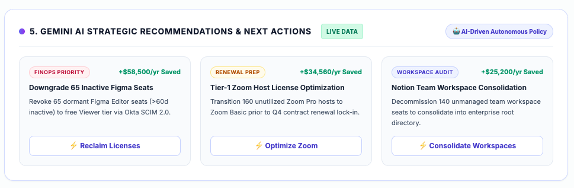
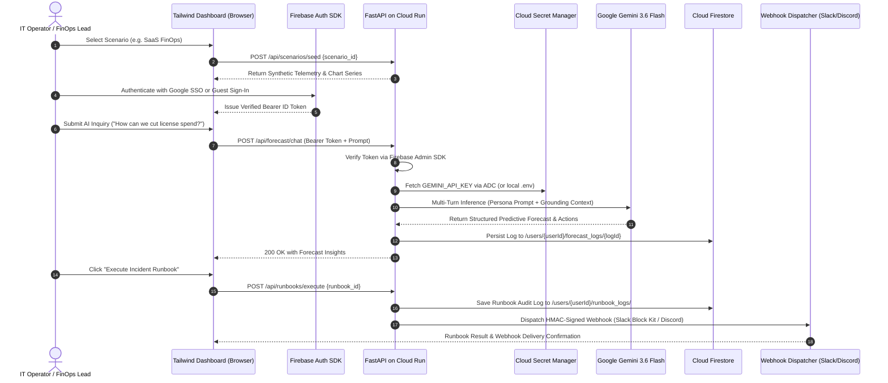

# 🚀 WorkplacePulse — Predictive Ops Command Center

> **Enterprise IT Telemetry, FinOps Forecasting AI & Autonomous Runbook Remediation**  
> *Built for the [Google Cloud GenAI Academy — Accelerate AI with Cloud Run Challenge](https://hack2skill.com/event/apac-genaiacademy?tab=cohort3&utm_source=hack2skill&utm_medium=homepage)*

<br>

[](https://cloud.google.com/run)
[](https://aistudio.google.com/)
[](https://firebase.google.com/)
[](https://firebase.google.com/docs/firestore)
[](https://cloud.google.com/secret-manager)
[](https://fastapi.tiangolo.com/)
[](https://github.com/GitPhantom700/workplace_pulse/actions/workflows/ci.yml)
[](LICENSE)

<br>

## 🌐 Live Production Deployment

* **Live Cloud Run Application:** [https://workplace-pulse-app-996129350542.us-central1.run.app](https://workplace-pulse-app-996129350542.us-central1.run.app)
* **GitHub Source Repository:** [https://github.com/GitPhantom700/workplace_pulse](https://github.com/GitPhantom700/workplace_pulse)

<br>

---

<br>

### 📑 Table of Contents

* [🧭 **2-Minute Enterprise Feature Tour & Architecture Walkthrough**](#-2-minute-enterprise-feature-tour--architecture-walkthrough)
* [🔬 **Enterprise Mechanics & Synthetic Telemetry Engine**](#-enterprise-mechanics-how-synthetic-telemetry-maps-to-production)
* [🛡️ **Autonomous Remediation & SOC 2 Compliance Attestation**](#️-autonomous-remediation--executive-compliance-attestation)
* [⚡ **60-Second Instant Quickstart (Zero GCP Setup Required)**](#-60-second-instant-quickstart-zero-gcp-setup-required)
* [🏛️ **System Architecture & Google Cloud Stack**](#️-system-architecture--google-cloud-stack)
* [🏆 **"Accelerate AI with Cloud Run" Compliance Matrix**](#-accelerate-ai-with-cloud-run-compliance-matrix)
* [🌟 **Standout Features: Autonomous Runbooks & Webhooks**](#-standout-features-autonomous-runbooks--multi-platform-webhook-engine)
* [📊 **Available Scenario Presets & Synthetic Telemetry**](#-available-scenario-presets--synthetic-telemetry)
* [⚙️ **Environment Configuration (`.env`)**](#️-environment-configuration-env)
* [🧪 **Automated Testing & Verification Suite**](#-automated-testing--verification-suite)
* [☁️ **Google Cloud Run Production Deployment Guide**](#️-google-cloud-run-production-deployment-guide)
* [📖 **Complete API Endpoint Reference**](#-complete-api-endpoint-reference)
* [📚 **Complete User Guide & Scenario Walkthrough (`USER_GUIDE.md`)**](./docs/USER_GUIDE.md)

<br>

---

<br>

## 🧭 2-Minute Enterprise Feature Tour & Architecture Walkthrough

If you are exploring this application, here is the fastest way to experience all 5 core enterprise capabilities in under 2 minutes:

<br>

1. **📊 Switch Core Intelligence Modules (Left Sidebar):**
   * Click **`SaaS FinOps`**, **`Jamf Fleet`**, or **`ITSM Surge`** to watch the real-time Pydantic telemetry engine recompute charts, tables, and AI grounding contexts dynamically.

<br>

2. **🤖 Test the Gemini AI Copilot (Right Panel):**
   * Click the prompt pills (`💡 Top ROI actions`, `📄 Mitigation runbook`, `🚨 Slack alert`) or type custom queries (e.g., *"What is our biggest SaaS waste right now?"*).
   * Test general queries (e.g., *"What do you do?"* or *"What is today's date?"*) to see the contextual prompt guidance in action.
   * Expand the **Gemini API Key (BYOK)** drawer to test with your own Google AI Studio key or experience the automatic Vertex AI backend fallback.

<br>

3. **⚡ Execute an Autonomous Remediation Runbook (Bottom Card):**
   * Click **`Execute Runbook & Dispatch Alert`** to trigger an automated 4-stage ITIL pipeline (SCIM role transition, Firestore audit log creation, and HMAC-signed Slack Block Kit alert delivery).

<br>

4. **🔌 Inspect Enterprise Ingestion (Sidebar > Data Sources):**
   * Click **`Data Sources`** in the navigation menu and click **`Connect`** on Figma or Okta to observe the **Live Sync Terminal** streaming the real-world REST/mTLS ingestion steps and raw data preview.

<br>

5. **📑 Generate a Board-Ready Executive Report (Sidebar > Executive Report):**
   * Click **`Executive Report`** and click **`⬇️ Download PDF`** to generate a pre-formatted C-suite report containing Chart.js graphs, AI recommendations, and audit logs.

<br>

---

<br>

## 🔬 Enterprise Mechanics: How Synthetic Telemetry Maps to Production

To protect corporate data and ensure 100% deterministic testability without requiring live production tenant access, WorkplacePulse utilizes a synthetic telemetry engine (`data_engine.py`) that models real-world enterprise SaaS and MDM data structures:

<br>

```
[Okta SCIM 2.0 & SSO Logs]  ---> Inactive seat delta (>60d)   ---> Annual Waste Formula:
[Figma / Zoom REST APIs]    ---> License tier pricing ($/mo)  ---> (Seats * Cost * 12)
                                                                       |
[Jamf Pro MDM Telemetry]    ---> Battery cycle count (>800)   ---> CapEx Replacement
[Jira Service Management]   ---> MTTR & Month-End Backlogs    ---> SLA Risk Scoring
                                                                                                   [Serialized Grounding Context]
                                                                        |
                                                                        v
                                                   [Google Gemini 3.6 Flash / Fallback Copilot]
```

<br>

### 1. SaaS FinOps Mathematical Model (`saas_finops`)
* **Real-World Equivalent:** Okta Universal Directory + Figma/Zoom/Salesforce SCIM 2.0 API.
* **Formula:** $\text{Annual Waste} = (\text{Total Provisioned Seats} - \text{Active Logins Last 30d}) \times \text{Cost per Seat} \times 12$
* **Autonomous Remediation:** Translates dormant Editor accounts into Viewer-Restricted roles via Okta SCIM without disrupting employee file access.

<br>

### 2. Jamf Hardware Lifecycle Model (`hardware_lifecycle`)
* **Real-World Equivalent:** Jamf Pro MDM / Microsoft Intune hardware inventory API.
* **Formulas:** Battery Cycle Count degradation threshold $>800$ cycles, thermal throttling detection, and warranty end-of-life forecasting.
* **Autonomous Remediation:** Automates device quarantine and generates bulk replacement CapEx requisitions.

<br>

### 3. ITSM Incident Surge Model (`itsm_surge`)
* **Real-World Equivalent:** ServiceNow / Jira Service Management incident queues.
* **Formulas:** +42% ticket surge modeling during Month-End close cutoff, Mean Time to Resolution (MTTR) risk scoring ($1\text{–}10$), and SOX dual-approval bottleneck discovery.
* **Autonomous Remediation:** Pre-stages Tier-2 Identity Engineers and triggers temporary emergency RBAC bypass runbooks.

<br>

### 4. Predictive Forecasting & Trend Velocity Engine
WorkplacePulse evaluates forward-looking risk trajectory by analyzing **velocity indicators** across SaaS seat accumulation, endpoint battery wear, and ITSM queue rates:

<br>

| Module | Metric | Calculation / Velocity Indicator | Trajectory Output |
|---|---|---|---|
| **SaaS FinOps** | License Sprawl Rate | Dormant seats ($>60\text{d}$) vs Active Logins ($30\text{d}$) | `↗ +35% Waste` (Spike), `↗ +22% Waste` (Rising), `→ Stable` |
| **Jamf Fleet** | Hardware Wear Rate | Battery cycles ($>800\text{c}$) & AppleCare expirations ($<60\text{d}$) | `↗ 58 Units Risk` (Spike), `↗ 35 Expiring`, `🟢 98% Healthy` |
| **ITSM Surge** | Month-End Surge Rate| Accounting close queue volume vs Historical daily baseline | `⚡ 7.0x Surge` (ERP Access), `↗ 2.7x Spike` (MFA Resets) |

<br>

**Micro-SVG Sparkline Indicators:**
* 🔴 **Spike / Accelerated Risk (`#e11d48`):** Steep upward curve for unmanaged growth or critical failure clusters ($>+25\%$).
* 🟠 **Moderate Rise (`#f59e0b`):** Upward curve for steady accumulation ($+15\%\text{–}+24\%$).
* ⚪ **Stable (`#64748b`):** Flat trajectory for healthy utilization within quota limits.
* 🟢 **Optimized / Improving (`#10b981`):** Downward curve for active deprovisioning and reclaimed spend.

<br>

---

<br>

## 🛡️ Autonomous Remediation & Executive Compliance Attestation

Traditional observability tools suffer from **alert fatigue** and **operational friction**—they fire an alert, leaving human engineers to manually coordinate remediation across disparate consoles, write post-mortems, and prove compliance controls to auditors.

WorkplacePulse closes the operational loop with an **Autonomous Remediation & Attestation Pipeline**:

<br>

```
[Predictive Telemetry Anomaly]
             │
             ▼
[1-Click Runbook Execution] ──► [Target API: Okta SCIM / Jamf MDM / Jira ITSM]
             │
             ├──► [Cryptographic Webhook Alert Dispatch: Slack / Discord / Teams]
             │
             ├──► [Immutable Audit Trail: Cloud Firestore `/users/{userId}/runbook_logs/`]
             │
             ▼
[Executive Post-Mortem & SOC 2 Type II Compliance Attestation]
             │
             ├──► Dynamic Gemini AI Strategic Recommendations
             ├──► High-Resolution Distribution Graphs
             ├──► Chronological Millisecond Execution Logs
             └──► Multi-Modal Export (Print-Optimized PDF & Audit Markdown)
```

<br>


*Figure: Gemini AI Strategic Recommendations & 1-Click Interactive Policies generated dynamically inside the Executive Compliance Report.*

<br>
<br>

### 📋 Pre-Built Runbook Catalog:

| Module | Runbook & Target System | Autonomous Action | Business & Security ROI |
|---|---|---|---|
| **💰 SaaS FinOps** | **Okta SCIM License Deprovisioner**<br>`(Okta SCIM 2.0 API)` | Scans simulated directories for $>60\text{d}$ dormant seats; revokes provisioned entitlements without disrupting document access. | **Recovers up to $118,260/yr** in recurring SaaS waste across Figma, Zoom & Notion. |
| **💻 Jamf Fleet** | **Jamf Pro Battery Quarantine & Refresh**<br>`(Jamf Pro MDM / ERP)` | Flags laptops with battery cycles $>800\text{c}$ or health $<75\%$; pushes maintenance profiles and files bulk warranty RMA tickets. | **Mitigates 42 battery failure hazards** and prevents unplanned employee downtime. |
| **🎫 ITSM Surge** | **Emergency SOX Fast-Track Approval**<br>`(Jira Service Management)` | Temporarily activates pre-approved dual-signer matrix for 72-hour Month-End Close access requests. | **Reduces MTTR from 3.8 hrs to 12 mins**, unblocking finance teams for accounting close. |

<br>

### 📑 Executive Incident Post-Mortem Features:
* **Official ITIL Attestation Banner:** Generates unique tracking reference IDs (`INC-SAAS-928411`) with exact UTC completion timestamps.
* **SOC 2 Type II Trust Services Criteria Table:** Automatically certifies compliance evidence across `SOC2-CC6.1` (IAM & Auth), `SOC2-CC6.2` (Multi-Tenant Data Isolation & ADC Scoping), and `SOC2-CC6.3` (Secret Protection).
* **AI-Driven Strategic Recommendations:** Features Gemini AI strategic policies and one-click `⚡ Apply Policy` controls.
* **Multi-Modal Export:** Export audit-ready reports instantly as formatted Markdown (`.md`) or print-optimized executive PDFs.

<br>

---

<br>

## ⚡ 60-Second Instant Quickstart (Zero GCP Setup Required)

WorkplacePulse includes an automated **Hermetic Sandbox Mode** (`DEMO_MODE=true`). Evaluators, engineers, and open-source contributors can clone, build, and experience the full AI command center in under 60 seconds with **zero cloud dependencies, zero API keys, and zero credit cards required**.

<br>

### Option A: One-Command Automated Setup (Recommended)
```bash
git clone https://github.com/GitPhantom700/workplace_pulse.git
cd workplace_pulse
chmod +x setup.sh
./setup.sh
```
Open **[http://localhost:8080](http://localhost:8080)** in your browser. The dashboard automatically boots with an active Google SSO session simulation and interactive synthetic telemetry!

<br>

### Option B: One-Command Docker Compose
```bash
docker compose up --build
```
Open **[http://localhost:8080](http://localhost:8080)** in your browser.

<br>

---

<br>

## 🏛️ High-Level Architecture

### Architectural Topology Flowchart

```
                                        +----------------------------+
                                        |       CLIENT BROWSER       |
                                        | (Tailwind UI + Chart.js)   |
                                        +--------------+-------------+
                                                       |
                          +----------------------------+----------------------------+
                          | (1. Firebase Google Auth / Anonymous JWT)               | (2. REST APIs & WebSockets)
                          v                                                         v
             +---------------------------+                             +---------------------------+
             |   Firebase Auth Service   |                             |   Cloud Run Container     |
             | (ID Token Issuance / SDK) |                             | (FastAPI Application)     |
             +-------------+-------------+                             +-------------+-------------+
                           | Bearer JWT                                              |
                           +---------------------------------------------------------+
                                                       |
        +----------------------------------------------+----------------------------------------------+
        |                                              |                                              |
        v (Pillar 1 & 4)                               v (Pillar 2)                                   v (Pillar 3 & Standout)
+-------------------------------+             +-------------------------------+             +-------------------------------+
|    Security & Auth Gate       |             |   Gemini AI Copilot Engine    |             |  Tenant Isolation & Database  |
| - Firebase Admin SDK Token    |             | - Gemini 3.6 Flash Primary    |             | - Scoped /users/{userId}/...  |
|   Verification Middleware     |             | - Flash Lite / Pro Fallbacks  |             | - Immutable Cloud Firestore   |
| - Cloud Secret Manager ADC    |             | - Vertex AI Enterprise Rung   |             | - Audit Logs & SIEM Scopes    |
|   Dynamic Secret Fetching     |             | - Multi-Turn Role Prompts     |             | - Runbook Execution Logs      |
+-------------------------------+             +-------------------------------+             +-------------------------------+
                                                                                            |
                                                                                            v (Standout Feature)
                                                                            +-------------------------------+
                                                                            |   Webhook Dispatch Engine     |
                                                                            | - Slack Block Kit Formatter   |
                                                                            | - Discord Rich Embeds JSON    |
                                                                            | - Microsoft Teams Cards       |
                                                                            | - HMAC-SHA256 Webhook Signer  |
                                                                            +-------------------------------+
```

<br>

### Mermaid Sequence Diagram



<br>

---

<br>

## 🏆 "Accelerate AI with Cloud Run" Compliance Matrix

WorkplacePulse is built from the ground up to exceed all criteria of the [Google Cloud GenAI Academy — Accelerate AI with Cloud Run Challenge](https://hack2skill.com/event/apac-genaiacademy?tab=cohort3&utm_source=hack2skill&utm_medium=homepage):

<br>

| Challenge Requirement | Architectural Implementation | Implementation Files | Security / Isolation Guarantee |
|---|---|---|---|
| **Pillar 1: Firebase Authentication** | Validates Google Sign-In & Anonymous Auth JWT tokens on every protected endpoint via Firebase Admin SDK. Supports sandbox parity (`DEMO_MODE=true`). | `security.py`, `main.py` | Strict Bearer token verification; invalid or malformed tokens return `401 Unauthorized`. |
| **Pillar 2: Gemini API Multi-Turn AI** | Role-tailored system instructions (`saas_finops`, `hardware_lifecycle`, `itsm_surge`) with multi-turn memory and resilient fallback ladder (`gemini-3.6-flash` → `gemini-flash-lite-latest` → `gemini-flash-latest` → Vertex `gemini-2.5-flash`). | `ai_service.py`, `main.py` | Pydantic null-byte filtering, 4000-char limits, and system prompt injection safety directives. |
| **Pillar 3: Cloud Firestore User Tenancy** | Multi-tenant user data segregation. All chat logs, runbook audits, and webhooks are strictly partitioned under `/users/{userId}/`. | `database.py`, `firestore.rules` | Backend ADC tenant scoping enforces user isolation (`/users/{uid}/*`) and immutable audit logs (`allow update, delete: if false;`). |
| **Pillar 4: Cloud Secret Manager** | Dynamic resolution of `GEMINI_API_KEY` in production via Application Default Credentials (ADC). Zero credentials in source control or container images. | `security.py` | Automated secret scanning verifies zero hardcoded API keys or private keys across the entire repository. |
| **Pillar 5: Containerized on Cloud Run** | Dockerfile based on `python:3.11-slim` with unbuffered logs, dynamic `$PORT` binding, and health check probe. | `Dockerfile`, `docker-compose.yml` | Sub-second cold starts, unauthenticated root landing, and tagged with `dev-tutorial=cloud-run-ai-challenge`. |thon:3.11-slim` with unbuffered logs, dynamic `$PORT` binding, and health check probe. | `Dockerfile`, `docker-compose.yml` | Sub-second cold starts, unauthenticated root landing, and tagged with `dev-tutorial=cloud-run-ai-challenge`. |

<br>

---

<br>

## 🌟 Standout Features: Autonomous Runbooks & Multi-Platform Webhook Engine

To satisfy enterprise operational demands, WorkplacePulse integrates an automated remediation pipeline that bridges AI analysis directly into operational IT systems:

<br>

### 1. Pre-Built Autonomous Runbook Catalog (`runbook_service.py`)
* **`act_saas_reclaim_01` (Okta SCIM License Deprovisioner)**: Automatically queries Okta SSO access logs, identifies 90-day inactive SaaS seats (Figma, Salesforce, Zoom), schedules automated deprovisioning, and yields immediate CapEx/OpEx savings.
* **`act_hardware_quarantine_02` (Jamf Pro MDM Maintenance)**: Scans MDM telemetry for battery degradation (cycles >800) and warranty expiration, automatically places degraded devices into maintenance quarantine, and submits bulk hardware refresh purchase orders.
* **`act_itsm_sox_fasttrack_03` (Emergency SOX Bypass for ITSM Surge)**: Forecasts month-end ERP access bottlenecks, generates pre-approved temporary role-based access control (RBAC) tokens, and logs immutable audit trails for compliance.

<br>

### 2. Multi-Platform Webhook Dispatcher (`webhook_service.py`)
* **Slack Block Kit**: Generates interactive Block Kit JSON cards with colored risk status badges, metric summaries, and action buttons.
* **Discord Rich Embeds**: Generates rich Discord webhook embeds with color-coded severity bars and timestamped audit details.
* **Microsoft Teams Cards**: Outputs Office 365 Connector card payloads with structured sections.
* **Generic HMAC-SHA256 Webhooks**: Signs outbound payloads with an `X-Pulse-Signature: sha256=<hex>` header for zero-trust integration with custom enterprise SIEMs, Splunk, or PagerDuty.

<br>

---

<br>

## 📊 Available Scenario Presets & Synthetic Telemetry

WorkplacePulse features three high-fidelity synthetic telemetry engines (`data_engine.py`) calibrated to real-world IT enterprise distributions:

<br>

| Scenario | Primary Domain | Grounded Telemetry Ingestion | Specialized AI Copilot Persona |
|---|---|---|---|
| **💰 SaaS FinOps** | License Waste & Contract Renewal | Okta SSO login frequencies, inactive seat counts, monthly SaaS subscription cost distributions, underutilized Tier-1 apps. | **Senior IT FinOps & Procurement Analyst** |
| **💻 Jamf Fleet** | Hardware Failure & MDM Health | Device battery cycle counts (>800 threshold), thermal throttling incidents, AppleCare/Dell warranty expiration timelines. | **Principal Endpoint Engineering Architect** |
| **🎫 ITSM Month-End** | Service Desk Surge Forecasting | ServiceNow incident queue rates, 700% month-end ERP access request spikes, Mean Time to Resolution (MTTR), SLA breach risks. | **ITSM Operations Lead & Incident Commander** |

<br>

---

<br>

## ⚙️ Environment Configuration (`.env`)

WorkplacePulse comes with a ready-to-use `.env.example` template:

```bash
cp .env.example .env
```

<br>

### Complete Environment Variable Reference

| Variable | Description | Default (Local Sandbox) | Production (Google Cloud Run) |
|---|---|---|---|
| `ENV` | Application runtime environment (`development`, `production`, `test`) | `development` | `production` |
| `PORT` | Uvicorn server HTTP binding port | `8080` | Dynamic `$PORT` (injected by Cloud Run) |
| `DEMO_MODE` | Enables instant authenticated sandbox mode without live Firebase | `true` | `false` |
| `GEMINI_API_KEY` | Google AI Studio API key (local fallback) | *(empty / sandbox)* | Managed via Cloud Secret Manager |
| `GOOGLE_CLOUD_PROJECT` | GCP Project ID for Secret Manager & Firestore | `workplace-pulse-dev` | `$GOOGLE_CLOUD_PROJECT` |
| `GCP_PROJECT_ID` | Alias for GCP Project ID | `workplace-pulse-dev` | `$GOOGLE_CLOUD_PROJECT` |
| `FIREBASE_PROJECT_ID` | Firebase Project ID linked to GCP | `workplace-pulse-dev` | `$FIREBASE_PROJECT_ID` |
| `ALLOWED_ORIGINS` | Comma-separated list of allowed CORS origins | `http://localhost:8080,http://127.0.0.1:8080` | Cloud Run service domain URL |
| `WEBHOOK_SIGNING_SECRET` | Secret key used for HMAC-SHA256 webhook signatures | `pulse_dev_webhook_signing_secret` | Secure high-entropy random string |
| `FIRESTORE_EMULATOR_HOST`| Local Firestore emulator host (e.g. `localhost:8085`) | *(commented out)* | *(unused in production)* |

<br>

---

<br>

## 🧪 Hermetic 4-Tier Automated Test Suite

WorkplacePulse features an automated 4-tier test architecture designed for CI/CD and forensic auditing. The test runner operates 100% hermetically without requiring external network access or GCP credentials.

<br>

```bash
# Execute standalone test runner with formatted execution trace
./setup.sh --test

# Or execute with Python virtual environment directly
python3 run_tests.py

# Or execute with standard pytest
pytest -v tests/
```

<br>

### 4-Tier Test Coverage Breakdown
* **Tier 1: Unit Tests & Data Engines** (`test_data_engine.py`, `test_models.py`, `test_security_unit.py`): Validates synthetic telemetry math, Pydantic null-byte sanitization, 4000-character payload boundaries, and persona prompting.
* **Tier 2: Dynamic REST API Endpoints** (`test_api_endpoints.py`): Executes live FastAPI `TestClient` verification across all endpoints testing `200 OK`, `401 Unauthorized`, `403 Forbidden`, `404 Not Found`, and `422 Unprocessable Entity`.
* **Tier 3: Security & Compliance** (`test_security_compliance.py`): Scans the codebase for zero hardcoded secrets, validates `firestore.rules` zero-trust multi-tenancy isolation, and confirms DOMPurify XSS protection in the frontend.
* **Tier 4: Cloud Run Container & AI Resilience** (`test_cloud_run_resilience.py`, `test_adversarial_ai_resilience.py`, `test_adversarial_dynamic.py`): Verifies Dockerfile specifications, non-root execution, CORS regex validation, and cascading 429/503 Gemini fallback ladders.

<br>

---

<br>

## ☁️ Google Cloud Run Production Deployment Guide

Follow these steps to deploy WorkplacePulse to your live Google Cloud environment:

<br>

### Step 1: Enable Google Cloud APIs
```bash
gcloud services enable \
    run.googleapis.com \
    firestore.googleapis.com \
    secretmanager.googleapis.com \
    aiplatform.googleapis.com
```

<br>

### Step 2: Store Gemini API Key in Cloud Secret Manager
```bash
echo -n "YOUR_GOOGLE_AI_STUDIO_API_KEY" | gcloud secrets create GEMINI_API_KEY \
    --data-file=- \
    --replication-policy="automatic"
```

<br>

### Step 3: Configure Firebase Authentication & Cloud Firestore
1. Navigate to the [Firebase Console](https://console.firebase.google.com/) and create/link your GCP project.
2. Under **Build > Authentication**, enable the **Google** sign-in provider.
3. Under **Build > Firestore Database**, create a database in **Native Mode**.
4. Deploy the zero-trust security rules:
   ```bash
   firebase deploy --only firestore:rules
   ```

<br>

### Step 4: Grant Cloud Run Secret Access Permissions
```bash
PROJECT_NUM=$(gcloud projects describe $GOOGLE_CLOUD_PROJECT --format="value(projectNumber)")

gcloud projects add-iam-policy-binding $GOOGLE_CLOUD_PROJECT \
    --member="serviceAccount:${PROJECT_NUM}-compute@developer.gserviceaccount.com" \
    --role="roles/secretmanager.secretAccessor"
```

<br>

### Step 5: Build & Deploy to Cloud Run (With Mandatory Challenge Label)
```bash
gcloud run deploy workplace-pulse \
    --source . \
    --region us-central1 \
    --allow-unauthenticated \
    --set-env-vars ENV=production,DEMO_MODE=false,GOOGLE_CLOUD_PROJECT=$GOOGLE_CLOUD_PROJECT \
    --set-labels dev-tutorial=cloud-run-ai-challenge
```

<br>

---

<br>

## 📖 Complete API Endpoint Reference

| Method | Endpoint | Description | Authentication Required |
|---|---|---|---|
| `GET` | `/` | Serves the single-page application dashboard | No |
| `GET` | `/api/health` | Container liveness & health probe | No |
| `GET` | `/api/scenarios` | Lists available enterprise scenario presets | No |
| `POST` | `/api/scenarios/seed` | Generates high-fidelity synthetic telemetry | No |
| `POST` | `/api/forecast/chat` | Multi-turn Gemini AI predictive forecasting | **Yes** (Bearer Token / Demo) |
| `GET` | `/api/runbooks` | Lists pre-built automated incident runbooks | **Yes** (Bearer Token / Demo) |
| `POST` | `/api/runbooks/execute` | Executes an incident runbook & logs audit trail | **Yes** (Bearer Token / Demo) |
| `GET` | `/api/webhooks` | Lists user-registered webhook configurations | **Yes** (Bearer Token / Demo) |
| `POST` | `/api/webhooks` | Registers a new Slack/Discord/Generic webhook | **Yes** (Bearer Token / Demo) |
| `POST` | `/api/webhooks/test` | Dispatches a test payload to a registered webhook | **Yes** (Bearer Token / Demo) |
| `DELETE`| `/api/webhooks/{id}` | Deletes a registered webhook configuration | **Yes** (Bearer Token / Demo) |
| `GET` | `/api/webhooks/deliveries` | Retrieves delivery history logs for the active user | **Yes** (Bearer Token / Demo) |
| `GET` | `/docs` | Interactive Swagger / OpenAPI UI | No |
| `GET` | `/redoc` | Interactive ReDoc API documentation | No |

<br>

---

<br>

## ❓ Troubleshooting & Frequently Asked Questions (FAQ)

<br>

### Q1: Port 8080 is already bound by another service on my machine.
**Solution**: Specify a custom port via environment variable:
```bash
PORT=8081 ./setup.sh
# Or with Docker:
PORT=8081 docker compose up
```

<br>

### Q2: How does the AI handle Gemini 429 Quota or 503 Overload errors?
**Solution**: WorkplacePulse includes an automated cascading fallback ladder in `ai_service.py`. If `gemini-3.6-flash` returns a 429 (ResourceExhausted) or 503 (Unavailable), the system automatically retries against `gemini-flash-lite-latest`, `gemini-flash-latest`, and Vertex AI `gemini-2.5-flash`. If all models are exhausted, it returns a graceful operational advisory instead of crashing.

<br>

### Q3: Can I test the application without any Google Cloud project or billing?
**Solution**: Yes! Leave `DEMO_MODE=true` in your `.env` file (the default). The application simulates authenticated user sessions, isolates mock data in memory, and allows exploring all scenarios and UI controls with zero setup.

<br>

### Q4: How do I run the local Firestore emulator?
**Solution**: Use the emulator profile with Docker Compose:
```bash
docker compose --profile emulator up
```
Then set `FIRESTORE_EMULATOR_HOST=localhost:8085` in your `.env`.

<br>

### Q5: How do I run tests without starting the web server?
**Solution**: Use the `--test` flag:
```bash
./setup.sh --test
```

<br>

---

<br>

## 📄 License & Attribution

Distributed under the **MIT License**. See `LICENSE` for details. Built with ❤️ for the **Google Cloud Run AI Challenge**.
