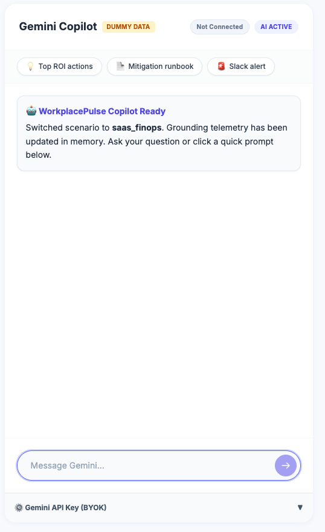

# WorkplacePulse User Guide

Welcome to the **WorkplacePulse** command center. This platform provides continuous, multi-tenant intelligence, bringing your IT service management (ITSM), endpoint fleet health, and SaaS licensing telemetry into a unified, actionable dashboard powered by Google Gemini AI.

This guide walks you through the primary workflows, analytics views, and autonomous capabilities of the platform.

 

---

 

## 1. Authentication & Setup

> **💡 Purpose & Significance:**  
> Enterprise IT platforms require strict tenant segregation. WorkplacePulse enforces zero-trust data partitioning under `/users/{userId}/...` via Firebase Admin SDK and Cloud Firestore security rules. The Demo Mode toggle provides evaluators with a 60-second instant sandbox to explore all features with zero cloud configuration or credit cards required.

 

When you first navigate to the platform, you will be presented with the **Pre-Login Landing Page**. By default, the system operates in a simulated sandbox.

 

*Figure 1a: The pre-login landing page. The highlighted controls in the top right manage authentication and Demo Mode.*

 

### Getting Started Steps:

1. **Explore Sandbox:** Note the **Demo Mode: ON** toggle in the top right corner. This allows you to explore the dashboard using simulated dummy data without connecting live telemetry.
2. **Switch to Live Mode:** To connect to your live enterprise data, toggle Demo Mode to **OFF**. 
3. **Authenticate:** Click the **Sign in with Google** button in the top right corner. This will trigger the secure authentication popup.

 

*Figure 1b: Google Sign-In popup for tenant authentication.*

 

Upon successful authentication, your unique Tenant ID is assigned, and you will be routed to the live **WorkplacePulse Executive Dashboard**.

 

*Figure 1c: The post-login state showing your active User Profile, Demo Mode OFF, and live telemetry data.*

 
 

---

 

## 2. Navigating the Executive Dashboard

The main dashboard presents an aggregated, real-time command center for enterprise IT operations, hardware fleets, and software licensing.

 

### Key Performance Indicators (KPIs)

> **💡 Purpose & Significance:**  
> IT executives and FinOps leads cannot parse through thousands of raw log lines during incidents. These KPI summary cards deliver an immediate 5-second pulse check on total financial waste, operational workload surges, and hardware safety hazards—enabling rapid decision-making before drilling down into granular data.

 

At the top of the dashboard, real-time KPI metric cards provide an immediate snapshot of top operational exposures:

 

#### 1. Idle SaaS Capital
Tracks wasted annual spend on unassigned or dormant software licenses across your enterprise SaaS catalog.

 

 
 

#### 2. Support Ticket Surge
Monitors active service desk queues and flags volume anomalies exceeding normal operational baselines.

 

 
 

#### 3. Hardware Degradation
Evaluates physical endpoint fleet health, highlighting battery degradation and warranty expiration risks.

 

 
 

---

 

### Interactive Telemetry Scenarios

> **💡 Purpose & Significance:**  
> Enterprise IT is traditionally fragmented across isolated silos (FinOps in finance, Jamf in endpoint engineering, Jira in the service desk). Interactive Telemetry Scenarios unify these disparate domains into a single pane of glass, giving IT leaders complete cross-functional visibility.

 

You can filter data visualizations and re-pivot the entire dashboard using the left-hand **Scenario Navigation** bar:

 

#### Scenario A: SaaS FinOps (Okta / Figma / Zoom)
Visualizes license utilization versus spend to identify dormant accounts (>60 days inactive) and optimize upcoming contract renewals.

 

 
 

#### Scenario B: Hardware Lifecycle (Jamf Fleet)
Maps device battery degradation (>800 cycle counts), thermal swelling risks, and AppleCare/Dell warranty expiration timelines across your endpoint fleet.

 

 
 

#### Scenario C: ITSM Surge (Jira Service Management)
Details support ticket spikes, Mean Time to Resolution (MTTR), and service desk bottlenecks during critical periods like Month-End Financial Close.

 

 
 

---

 

### Predictive Forecasting & Trend Velocity (Q4 Forecast Trend)

> **💡 Purpose & Significance:**  
> Traditional IT dashboards only report historical failures after they happen. WorkplacePulse shifts IT operations from *reactive firefighting* to *predictive mitigation*, saving thousands of dollars in unneeded renewals, CapEx waste, and costly operational downtime.

 

The **Detailed Telemetry Matrix** in each module includes a forward-looking **Q4 Forecast Trend** column powered by leading velocity indicators:

*   **SaaS FinOps Velocity:** Evaluates dormancy accumulation velocity (e.g., `↗ +35% Waste` on Figma Enterprise) to calculate contract exposure before annual renewal lock-in.

 

 
 

*   **Hardware Lifecycle Velocity:** Projects quarterly failure rates across laptop batches to calculate exact CapEx refresh budgets before hardware fails in the field.

 

 
 

*   **ITSM Surge Multiplier:** Quantifies projected ticket surge multipliers (e.g., `⚡ 7.0x Surge` in ERP access) to schedule engineer shifts and prevent SLA breaches.

 

 
 

*   **Micro-Sparklines:** Inline SVG Bézier curves visually indicate trajectory at a glance (🔴 High Risk Spike, 🟠 Moderate Growth, ⚪ Stable, 🟢 Optimized).

 

| SaaS FinOps Sparklines | Hardware Lifecycle Sparklines | ITSM Surge Sparklines |
| :---: | :---: | :---: |
|  |  |  |

 
 

---

 

## 3. Gemini Copilot & Bring-Your-Own-Key (BYOK)

> **💡 Purpose & Significance:**  
> Generative AI without grounding produces generic hallucinations. WorkplacePulse serializes live telemetry into structured Pydantic payloads that feed Gemini's context window. Gemini acts as an autonomous staff-level FinOps consultant—instantly identifying exact dollar savings, drafting ITIL runbooks, and formatting Slack Block Kit alert payloads. The BYOK architecture guarantees client privacy by storing keys strictly in ephemeral browser session memory.

 

WorkplacePulse integrates directly with Google's Gemini AI to offer strategic recommendations grounded in your active telemetry.

 

### Connecting Your API Key (Live Data Mode)

By default, the platform runs with a resilient multi-client ladder. To test with your personal Google AI Studio credentials:

1. Locate the **Gemini Copilot** panel on the right side of the dashboard.

 

 
 

2. Expand the **Gemini API Key (BYOK)** drawer.

 

 
 

3. Enter your **Gemini API Key** and click **Connect**.

 

 
 

4. The system validates your key in session memory and switches the telemetry badges to Live Data.

 

 
 

5. **Ask Grounded Operational Questions:** Type an inquiry into the chat box (e.g., *"Can you forecast Zoom pro demand for the next three months?"*) or select a suggested prompt pill. Gemini analyzes the active telemetry context in real time.

 

| 1. Submitting Inquiry (Thinking State) | 2. Completed FinOps Telemetry Assessment |
| :---: | :---: |
|  |  |

 
 

---

 

## 4. Managing Data Sources

> **💡 Purpose & Significance:**  
> Enterprise transparency requires proving where data originates. The Data Sources hub and Live Sync Terminal provide full visibility into the ingestion pipeline, ensuring compliance officers and security teams can verify data provenance, API scopes, and encryption protocols.

 

The **Data Sources** view (accessible via the sidebar) allows IT administrators to manage third-party integrations across Okta, Figma, Jamf Pro, Jira, and Zoom.

1. Click on **Data Sources** in the left navigation menu.
2. You will see connection cards for all supported enterprise platforms.
3. Click **Connect / Sync** on any integration to launch the **Live Data Sync Terminal**.
4. The terminal streams the real-time mTLS handshake, OAuth token exchange, REST endpoint queries, and delta calculation steps, followed by a **Raw Data Preview Table**.

 
 

---

 

## 5. Webhooks & Alerting

> **💡 Purpose & Significance:**  
> Insights are useless if they remain trapped in a dashboard. The Webhook Engine closes the loop by automatically dispatching formatted, actionable alerts to incident response channels, enabling engineers to approve 1-click license reclaims or shift adjustments without leaving Slack.

 

WorkplacePulse autonomously bridges predictive intelligence into your team's everyday communication channels.

1. Click the 🔔 **Alerts** icon or navigate to **Webhook Hub** in the sidebar.
2. Register destination endpoints for **Slack**, **Discord**, **Microsoft Teams**, or custom REST webhooks.
3. Use the **Simulation Mode** tab to test payload delivery.
4. Outbound payloads are formatted using native rich cards (e.g. Slack Block Kit) and cryptographically signed with an `X-Pulse-Signature: sha256=<hex>` HMAC-SHA256 header.
5. Inspect the **Delivery Audit Trail** to view execution timestamps and HTTP delivery response codes.

 
 

---

 

## 6. Live Support & Troubleshooting

> **💡 Purpose & Significance:**  
> Reduces Tier-1 IT helpdesk burden by resolving common user queries autonomously while providing a clear, auditable escalation path for enterprise procurement and security inquiries.

 

The **Support & Help** section provides self-service onboarding assistance and direct escalation channels.

*   **Interactive Knowledge Base:** Browse expandable FAQs regarding BYOK setup, billing tiers, and data governance.
*   **Ticket Submission:** Open a formal IT escalation ticket with built-in form validation.
*   **Sentinel Support Copilot:** Chat in real time with "Alex", the empathetic AI support specialist, for 24/7 troubleshooting and guidance.

 
 

---

 

## 7. Generating Executive Reports

> **💡 Purpose & Significance:**  
> IT and FinOps managers spend hours manually aggregating data and formatting slide decks for executive reviews. The Executive Report generator automates this entire process in one click, producing audit-ready financial summaries for quarterly budget approvals and executive sign-offs.

 

WorkplacePulse includes an automated reporting engine designed for C-suite and board presentations.

1. Click the **Export Report (PDF)** button at the top right of the dashboard.
2. The platform renders a clean, print-optimized executive summary modal containing key ROI metrics, active Chart.js visualizations, Gemini strategic recommendations, and audit logs.
3. Click **⬇️ Download PDF** to generate an uncorrupted, multi-page PDF document free of awkward page breaks.
